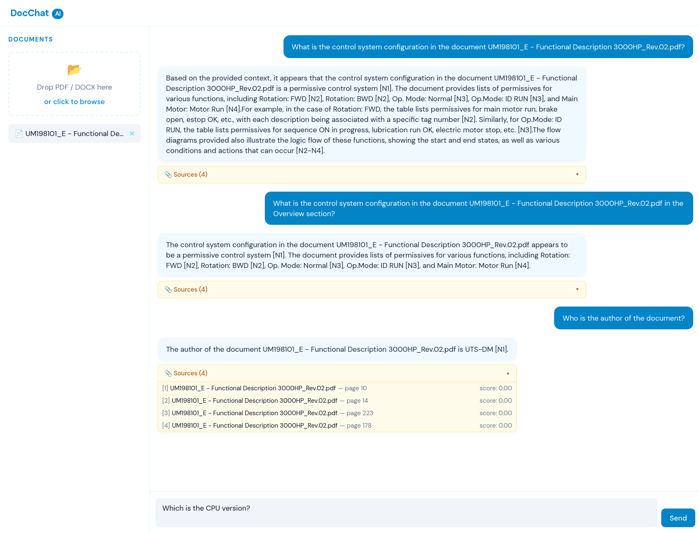
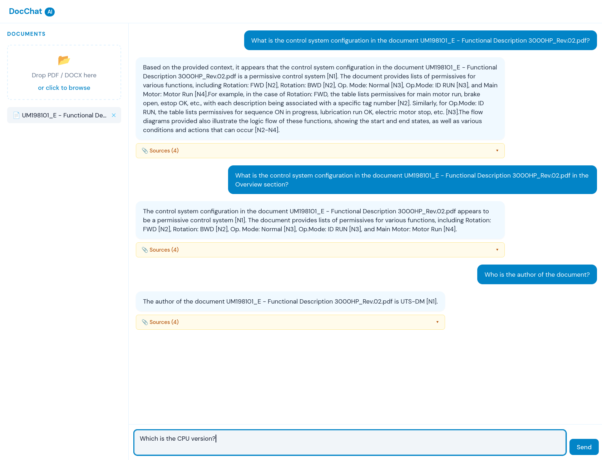

# DocChat AI

A RAG (Retrieval-Augmented Generation) chatbot that lets you upload PDF and DOCX documents and ask questions about them. Answers are grounded exclusively in the uploaded content and include source citations with relevance scores.



---

## Features

- **Document ingestion** — Upload PDF and DOCX files (up to 50 MB). Text is parsed, chunked, embedded, and stored in a persistent vector database.
- **Semantic retrieval** — Questions are embedded and matched against document chunks using cosine similarity.
- **BGE re-ranking** — A cross-encoder reranker (BAAI/bge-reranker-base) scores the top 15 candidates and keeps the 4 most relevant chunks, improving answer quality over naive top-k retrieval.
- **Grounded answers** — The LLM is instructed to answer only from retrieved context and to cite sources. If the context is insufficient, it says so.
- **Source citations** — Every response includes the source filenames, page numbers, and relevance scores of the chunks used.
- **Conversation context** — The last 3 Q&A turns are included in each request, enabling follow-up questions.
- **Streaming responses** — Answers stream token-by-token via Server-Sent Events.
- **Switchable LLM** — One env var switches between Ollama (local, free) and Claude (Anthropic API).
- **Page-level filtering** — Queries like "what does page 5 say about X?" trigger a ChromaDB metadata filter, narrowing retrieval to that page.

## Screenshots

| Chat interface                             | Source citations                              |
| ------------------------------------------ | --------------------------------------------- |
|  |  |

---

## Architecture

```
User question
     │
     ▼
Embed question (BAAI/bge-small-en-v1.5, 384-dim)
     │
     ▼
ChromaDB vector search → top 15 chunks
     │
     ▼
BGE cross-encoder reranker → top 4 chunks
     │
     ▼
Build prompt (context + last 3 conversation turns)
     │
     ▼
LLM (Ollama llama3.2 or Claude claude-haiku-4-5)
     │
     ▼
Stream answer + citations to frontend (SSE)
```

### Tech stack

| Layer            | Technology                                                      |
| ---------------- | --------------------------------------------------------------- |
| Backend          | FastAPI + uvicorn                                               |
| Validation       | Pydantic v2 + pydantic-settings                                 |
| Document parsing | pypdf, python-docx                                              |
| Chunking         | langchain-text-splitters (RecursiveCharacterTextSplitter)       |
| Embeddings       | sentence-transformers — BAAI/bge-small-en-v1.5 (local, 384-dim) |
| Vector DB        | ChromaDB (embedded, persistent on disk)                         |
| Re-ranking       | BAAI/bge-reranker-base (CrossEncoder)                           |
| LLM — dev        | Ollama (llama3.2:3b, runs locally)                              |
| LLM — prod       | Anthropic Claude (claude-haiku-4-5)                             |
| Frontend         | React 18 + Vite + Tailwind CSS v3                               |
| Package manager  | uv (backend), npm (frontend)                                    |
| Tests            | pytest (backend), vitest + React Testing Library (frontend)     |

---

## Local setup

### Prerequisites

- Python 3.12+
- [uv](https://docs.astral.sh/uv/)
- Node.js 18+
- [Ollama](https://ollama.com/) with `llama3.2:3b` pulled (`ollama pull llama3.2:3b`)

### Backend

```bash
cd docchat-backend
cp .env.example .env        # edit if needed
uv sync
uv run uvicorn app.main:app --reload
# → http://localhost:8000
```

### Frontend

```bash
cd docchat-frontend
npm install
npm run dev
# → http://localhost:5173
```

### Environment variables

| Variable             | Default                  | Description                         |
| -------------------- | ------------------------ | ----------------------------------- |
| `LLM_PROVIDER`       | `ollama`                 | `ollama` or `claude`                |
| `OLLAMA_BASE_URL`    | `http://localhost:11434` | Ollama server URL                   |
| `OLLAMA_MODEL`       | `llama3.2:3b`            | Ollama model name                   |
| `ANTHROPIC_API_KEY`  | —                        | Required when `LLM_PROVIDER=claude` |
| `CLAUDE_MODEL`       | `claude-haiku-4-5`       | Claude model ID                     |
| `CHROMA_PERSIST_DIR` | `./chroma_data`          | ChromaDB storage path               |
| `CHUNK_SIZE`         | `256`                    | Chunk size in tokens                |
| `TOP_K_RETRIEVAL`    | `15`                     | Candidates retrieved from ChromaDB  |
| `TOP_K_RERANK`       | `4`                      | Chunks kept after re-ranking        |

### Switch to Claude

```bash
# .env
LLM_PROVIDER=claude
ANTHROPIC_API_KEY=sk-ant-...
```

No code changes required.

---

## Usage tips

- Upload one or more PDFs or DOCX files using the sidebar drop zone.
- Ask specific questions using vocabulary likely to appear in the document.
- Page references work: _"What does page 5 say about deliverables?"_
- Follow-up questions work: the last 3 turns are included as conversation context.
- If the answer seems off, rephrase using keywords from the document — retrieval is semantic but benefits from lexical overlap.

---

## Privacy

When using `LLM_PROVIDER=ollama`, all processing runs locally — no data leaves your machine.

When using `LLM_PROVIDER=claude`, document chunks are sent to the Anthropic API under [commercial terms](https://www.anthropic.com/legal/commercial-terms): data is not used for model training and is retained for up to 7 days for abuse monitoring only.

---

## Project structure

```
docchat-ai/
├── docchat-backend/
│   ├── app/
│   │   ├── main.py              # FastAPI app + CORS
│   │   ├── config.py            # pydantic-settings (.env)
│   │   ├── ingestion/           # parser, chunker, embedder
│   │   ├── retrieval/           # vector_store, reranker
│   │   ├── llm/                 # base, ollama_client, claude_client
│   │   ├── rag/                 # pipeline, query_parser
│   │   └── api/                 # routes_documents, routes_chat
│   └── tests/
└── docchat-frontend/
    └── src/
        ├── components/
        │   ├── ChatPanel/       # ChatPanel, AIBubble, UserBubble, SourcesAccordion
        │   └── Sidebar/         # Sidebar, DropZone, DocumentList
        └── hooks/               # useChat, useDocuments
```

---

## Running tests

```bash
# Backend
cd docchat-backend
uv run pytest                        # all tests
uv run pytest -m "not slow"          # skip embedding/reranker integration tests

# Frontend
cd docchat-frontend
npm test
```

---

## License

MIT
